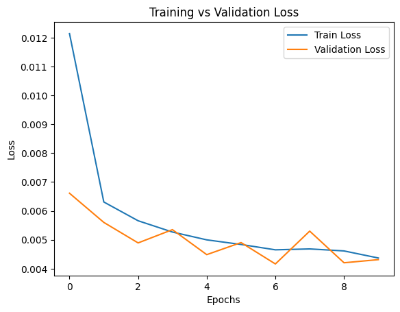

# 🌞 Monthly Sunspots Forecasting using LSTM

This project focuses on forecasting **monthly sunspot counts** using a **Long Short-Term Memory (LSTM)** neural network.  
Sunspot activity is a strong indicator of solar cycles, and modeling this time-series data helps in understanding periodic solar variations.

---

## 🧩 Project Overview

The notebook builds a **univariate time-series forecasting model** with the following key steps:

1. **Load & explore dataset** (`monthly_sunspots.csv`)
2. **Scale the data** using `MinMaxScaler`
3. **Create supervised sequences** with custom time steps
4. **Split the data** into training and test sets
5. **Build a 2-layer LSTM model**
6. **Train and validate** using `Mean Squared Error (MSE)` loss
7. **Evaluate performance** using `MSE`, `RMSE`, and `MAE`
8. **Visualize training and validation loss curves**

---

## 📊 Dataset

- **Dataset Name:** `monthly_sunspots.csv`
- **Attributes:**
  - `Month` → time (YYYY-MM format)
  - `Sunspots` → monthly average count
- **Duration:** 1749 – 2024  
- **Source:** [NASA / SILSO Sunspot Dataset](https://www.sidc.be/silso/datafiles)

---

## 🧠 Model Architecture (LSTM)

| Layer Type | Units | Return Sequences | Activation | Description |
|-------------|--------|------------------|-------------|--------------|
| Input | 12 time steps | – | – | Sequence input |
| LSTM | 64 | True | tanh | Captures temporal dependencies |
| LSTM | 32 | False | tanh | Deeper sequence learning |
| Dense | 1 | – | Linear | Predicts next sunspot value |

---

## ⚙️ Model Training

| Parameter | Value |
|------------|-------|
| Optimizer | Adam |
| Learning Rate | 0.001 |
| Loss Function | Mean Squared Error (MSE) |
| Epochs | 10 |
| Batch Size | 32 |

---

## 📈 Evaluation Metrics

| Metric | Value |
|---------|--------|
| **Mean Squared Error (MSE)** | 277.84 |
| **Root Mean Squared Error (RMSE)** | 16.68 |
| **Mean Absolute Error (MAE)** | 12.01 |

---

## 📉 Training vs Validation Loss

A line plot to visualize model convergence and stability during training:



---

## 🧾 Results Summary

- The model successfully learned to predict **future sunspot counts** using past 12 months as input.
- Loss curves show **good convergence** and **no overfitting**.
- Error metrics (RMSE ≈ 16.68) indicate decent performance for this simple LSTM configuration.

---

## 🧑‍💻 Author

**Navdeep Khandelwal**  
📍 Rajasthan, India  
🎓 Certified in Artificial Intelligence, Machine Learning & Deep Learning — *IIT Delhi (2025)*  
🔗 [GitHub Profile](https://github.com/navdeepkhandelwal)

---

## 📦 Requirements

Install dependencies before running the notebook:

```bash
pip install tensorflow pandas numpy scikit-learn matplotlib
